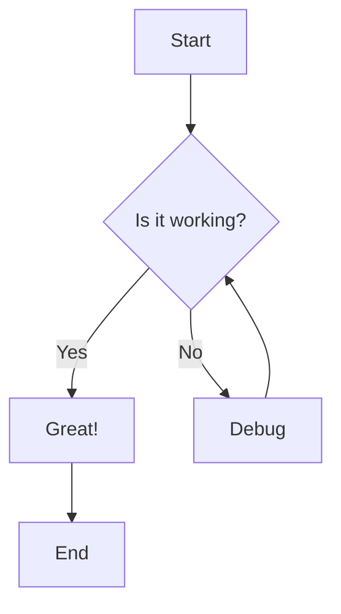
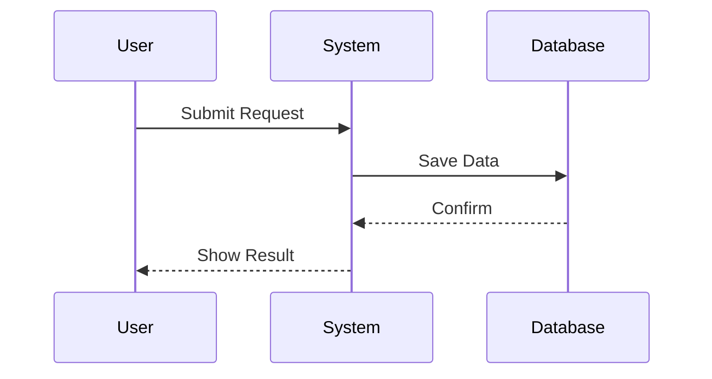
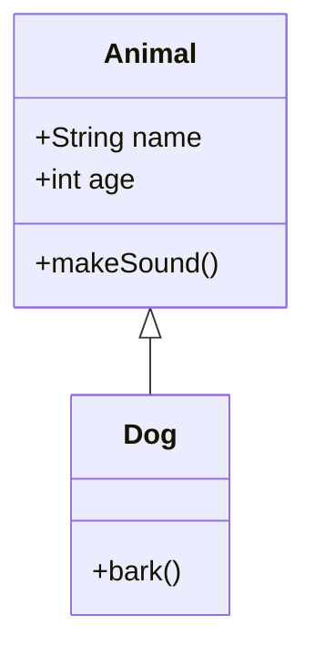
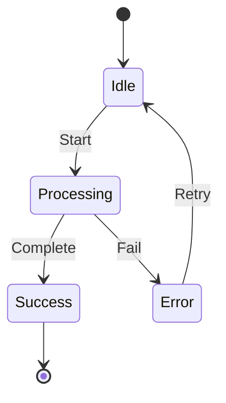
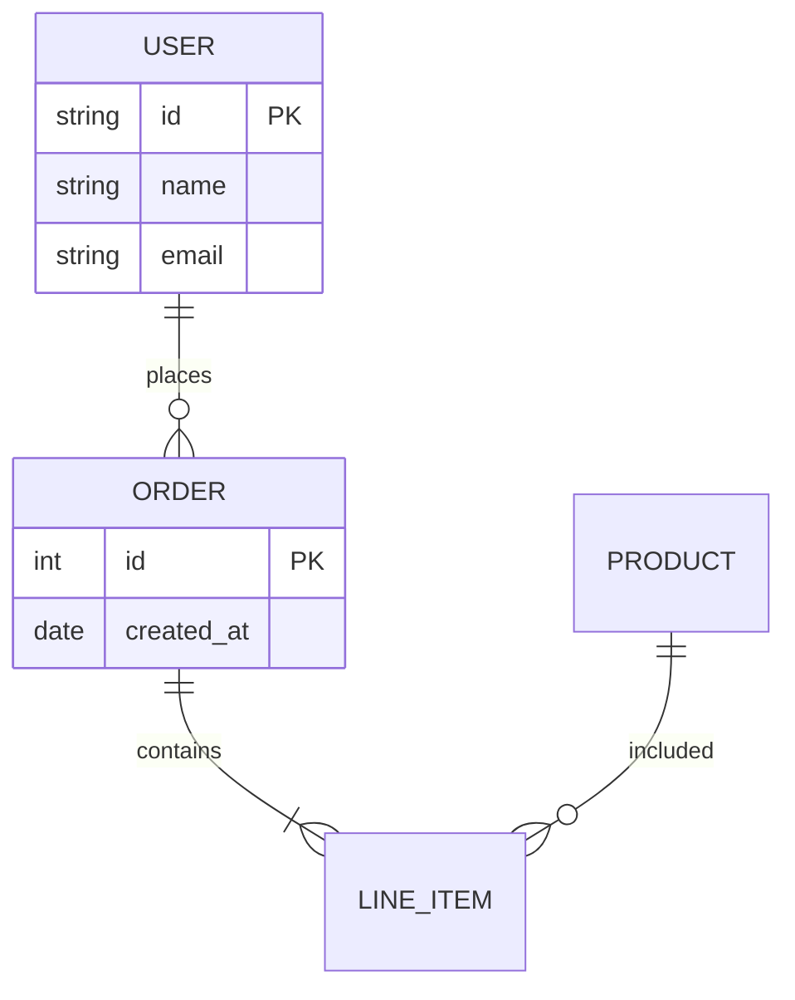
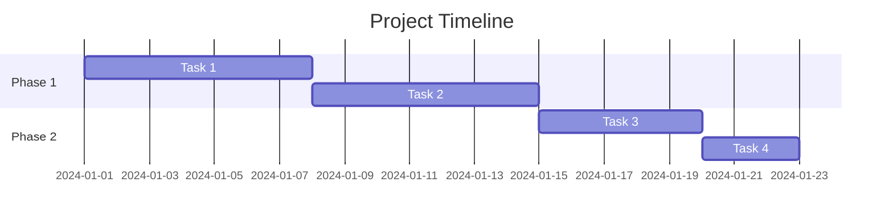
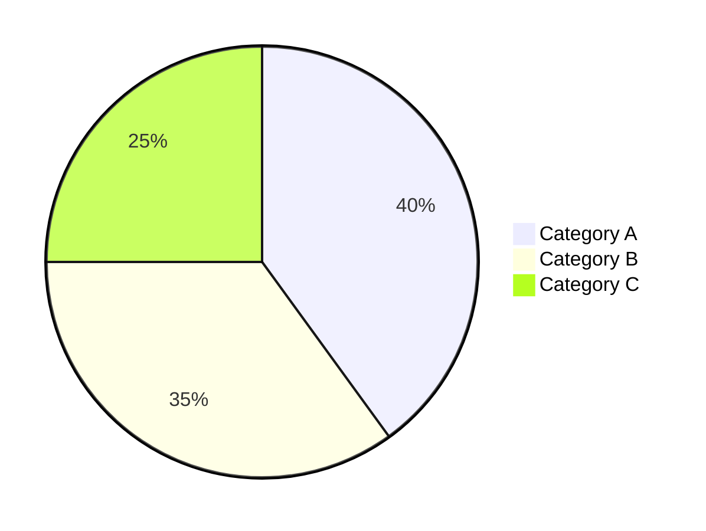
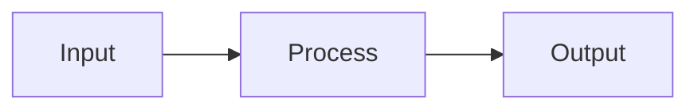
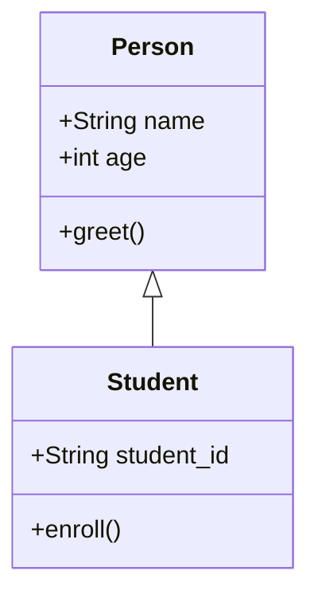

# Article Skill Guide

This guide covers all the markdown syntax and visual elements you can use in articles. All content will be rendered using react-markdown with supporting plugins.

---

## 1. Basic Markdown (CommonMark)

### Headings

```markdown
# Heading 1
## Heading 2
### Heading 3
#### Heading 4
##### Heading 5
###### Heading 6
```

### Text Formatting

```markdown
**Bold text**
*Italic text*
***Bold and italic***
~~Strikethrough~~
`Inline code`
```

### Links and Images

```markdown
[Link text](https://example.com)

```

### Blockquotes

```markdown
> This is a blockquote.
> It can span multiple lines.
```

### Lists

**Unordered:**
```markdown
- Item 1
- Item 2
  - Nested item
```

**Ordered:**
```markdown
1. First item
2. Second item
3. Third item
```

### Code Blocks

Use fenced code blocks with language identifier:

````markdown
```python
def hello():
    print("Hello, World!")
```
````

````markdown
```javascript
function greet(name) {
  return `Hello, ${name}!`;
}
```
````

### Horizontal Rule

```markdown
---
```

---

## 2. GitHub Flavored Markdown (GFM)

Enabled via `remark-gfm` plugin.

### Tables

```markdown
| Header 1 | Header 2 | Header 3 |
|----------|----------|----------|
| Cell 1   | Cell 2   | Cell 3   |
| Cell 4   | Cell 5   | Cell 6   |

| Left | Center | Right |
|:-----|:------:|------:|
| L    |   C    |     R |
```

### Task Lists

```markdown
- [ ] Unchecked task
- [x] Checked task
- [ ] Another task
```

### Strikethrough

```markdown
~~This text is crossed out~~
```

### Autolinks

```markdown
Visit https://www.example.com
```

---

## 3. Mathematical Expressions

Enabled via `remark-math` + `rehype-katex` plugins.

### Inline Math

```markdown
The formula $E = mc^2$ is famous.
The quadratic formula is $x = \frac{-b \pm \sqrt{b^2-4ac}}{2a}$.
```

### Display Math

```latex
$$
\int_{a}^{b} f(x) \,dx = F(b) - F(a)
$$

$$
\sum_{i=1}^{n} i = \frac{n(n+1)}{2}
$$

$$
\begin{pmatrix}
a & b \\
c & d
\end{pmatrix}
$$
```

### Common Math Symbols

```markdown
- Greek: $\alpha, \beta, \gamma, \delta, \theta, \lambda, \pi, \sigma$
- Operations: $\times, \div, \pm, \mp, \sqrt{}$
- Relations: $=, \neq, <, >, \leq, \geq, \approx$
- Sets: $\in, \notin, \subset, \cup, \cap, \emptyset$
- Calculus: $\int, \sum, \prod, \lim, \frac{d}{dx}$
```

---

## 4. Mermaid Diagrams

Enabled via `rehype-mermaid` plugin with Playwright.

### When to Use Diagrams

Use diagrams when content involves:

| Use Case | Best Diagram Type |
|----------|------------------|
| Step-by-step process | Flowchart (graph) |
| Decision tree | Flowchart with diamonds |
| User interactions | Sequence diagram |
| Object relationships | Class diagram |
| Application states | State diagram |
| Database structure | ER diagram |
| Project timeline | Gantt chart |
| Data distribution | Pie chart |

### Flowchart

Use for: Processes, workflows, algorithms, decision trees

````markdown

````

**Direction indicators:**
- `TD` or `TB` - Top to Bottom
- `BT` - Bottom to Top
- `LR` - Left to Right
- `RL` - Right to Left

**Node shapes:**
- `[Rectangle]` - Default node
- `(Rounded)` - Rounded rectangle
- `{Diamond}` - Decision/rhombus
- `[/Parallelogram/]` - Input/output
- `[[Subroutine]]` - Subroutine

**Edge styles:**
- `A --> B` - Arrow
- `A --- B` - Line
- `A -->|Label| B` - Labeled arrow
- `A ==>|Label| B` - Thick arrow

### Sequence Diagram

Use for: API calls, user interactions, system communications

````markdown

````

### Class Diagram

Use for: Object-oriented structures, inheritance, relationships

````markdown

````

### State Diagram

Use for: Application states, user flows, business logic

````markdown

````

### Entity Relationship Diagram

Use for: Database schema, data models, entity relationships

````markdown

````

### Gantt Chart

Use for: Project timelines, schedules, task durations

````markdown

````

### Pie Chart

Use for: Proportions, distributions, percentages

````markdown

````

### Diagram Best Practices

1. **Keep it simple** - Don't overload diagrams with too many elements
2. **Clear labels** - Use descriptive names for nodes and edges
3. **Appropriate direction** - Choose LR/TD based on content flow
4. **Logical grouping** - Group related elements together
5. **Consistent styling** - Use same node shapes for same type elements

---

## 5. Code Syntax Highlighting

Always specify the language for proper highlighting:

### JavaScript/TypeScript

````markdown
```javascript
const add = (a, b) => a + b;

async function fetchData() {
  const response = await fetch('/api/data');
  return response.json();
}
```
````

### Python

````markdown
```python
def calculate_mean(numbers):
    """Calculate the mean of a list of numbers."""
    return sum(numbers) / len(numbers)

class DataProcessor:
    def __init__(self, data):
        self.data = data
```
````

### SQL

````markdown
```sql
SELECT users.name, COUNT(orders.id) as order_count
FROM users
LEFT JOIN orders ON users.id = orders.user_id
WHERE orders.created_at > '2024-01-01'
GROUP BY users.name
ORDER BY order_count DESC;
```
````

### JSON

````markdown
```json
{
  "name": "John",
  "age": 30,
  "skills": ["Python", "JavaScript", "SQL"]
}
```
````

### Bash/Shell

````markdown
```bash
#!/bin/bash
for file in *.txt; do
  echo "Processing $file"
  wc -l "$file"
done
```
````

---

## 6. Best Practices

### Structure Your Article

1. **Title & Subtitle** - Catch attention, clarify scope
2. **Learning Objective** - What reader will learn
3. **Introduction** - Hook + context + why it matters
4. **Main Content** - Logical sections with clear headings
5. **Code Examples** - For technical topics
6. **Visual Elements** - Diagrams, tables, math when helpful
7. **Practice** - Exercises or questions
8. **Summary** - Key takeaways + next steps

### Use Visual Elements Wisely

- **Diagrams**: Complex relationships, flows, structures, processes
- **Tables**: Comparisons, data, specifications
- **Code**: Technical examples, implementations
- **Math**: Formulas, calculations, proofs
- **Lists**: Steps, features, options

### Make It Human

- Vary sentence length and structure
- Use transitions naturally, not formulaically
- Include relevant examples and analogies
- Write with personality
- Avoid AI-sounding patterns

---

## 7. Example Article Structure

```markdown
# Mastering Python Functions

## What You'll Learn
By the end of this article, you'll be able to write clean, reusable functions.

## Why Functions Matter
Functions are the building blocks...

## How Functions Work

Here's the flow of a function:



### Defining a Function
```python
def greet(name):
    return f"Hello, {name}!"
```

### Parameters and Arguments
...

## Class Structure

For object-oriented programming:



## Common Pitfalls
...

## Practice Exercise
Write a function that...

## Summary
- Key point 1
- Key point 2
```

---

Remember: Write each article uniquely. Adapt the structure, tone, and examples to match the specific topic and audience indicated by the title. Use diagrams whenever they can help clarify complex relationships, processes, or structures.
