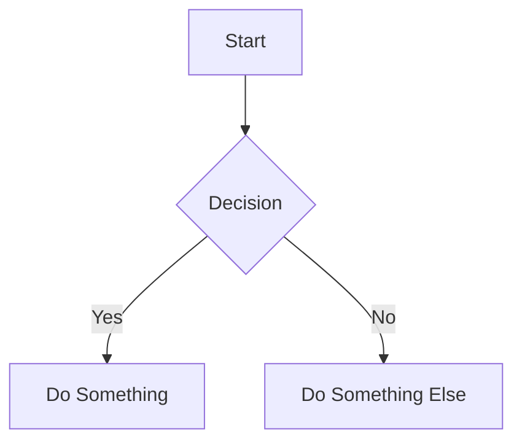
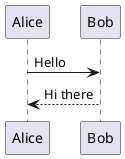

# Slide Skill

## Overview
This skill guides you through creating Slidev presentations.

## Required Elements

Every presentation must include:

1. **Clear Learning Objective**
   - State what learner will be able to do after

2. **Engaging Title & Subtitle**
   - Title: grabs attention
   - Subtitle: clarifies the specific skill/concept

3. **Introductory Hook**
   - Frame why the topic matters

4. **Structured Content**
   - Logical sections with descriptive headings

5. **Summary & Next Steps**
   - Recap and suggest further learning

## Theme Selection

Choose appropriate theme in frontmatter:

```yaml
---
theme: seriph
---
```

### Available Themes

| Theme | Best For |
|-------|----------|
| `default` | General purpose, professional |
| `apple-basic` | Clean, minimal, modern |
| `shibainu` | Creative, playful |
| `seriph` | Elegant, professional |

## Slide Syntax

### Slide Separators
Use `---` to separate slides:

```markdown
# Slide 1 Title

Content here...

---

# Slide 2 Title

Content here...
```

### Frontmatter

**Global:**
```yaml
---
theme: seriph
title: Presentation Title
author: Your Name
---
```

**Per-slide:**
```yaml
---
layout: center
background: /image.png
class: text-white
---

# Slide Content
```

## Code Blocks

```python
def greet(name: str) -> str:
    return f"Hello, {name}!"
```

### Line Highlighting
```python {2-3}
def greet(name: str) -> str:
    print("Starting...")
    return f"Hello, {name}!"
```

## LaTeX Math

Inline: `$E = mc^2`

Display:
```
$$
f(x) = \int_{-\infty}^{\infty} \hat f(\xi) e^{2\pi i \xi x} d\xi
$$
```

## Diagrams

### Mermaid


### PlantUML


## Animations

Add transition in frontmatter:
```yaml
---
transition: slide-left
---
```

Use `v-click` for element animations:
```markdown
- Item 1 v-click
- Item 2 v-click
- Item 3 v-click
```

## Layouts

| Layout | Use Case |
|--------|----------|
| `cover` | Title slide |
| `center` | Centered content |
| `section` | Section divider |
| `image-right` | Content + image |
| `quote` | Featured quote |
| `fact` | Statistics |
| `default` | Standard slide |

## Guidelines

1. Include clear learning objective at start
2. Structure content logically
3. Use appropriate theme
4. Include code examples for technical topics
5. Use diagrams for complex concepts
6. **Max 30 words per slide**
7. One idea per slide
8. Include summary at end
9. Resize large diagrams: `{scale: 0.5}`

## Output Format
Complete Slidev markdown with frontmatter.
